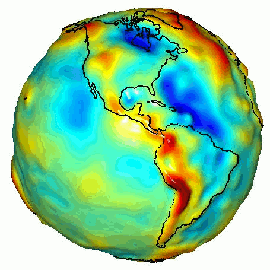
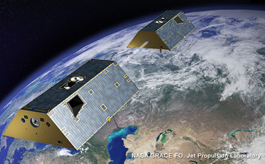
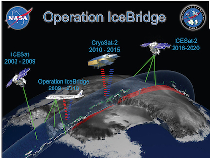

**STILL UNDER CONSTRUCTION**

---

<h1>Yara Mohajerani</h1>
   
Email: <ymohajer@uci.edu>&nbsp;&nbsp;&nbsp;&nbsp;&nbsp;&nbsp;&nbsp;&nbsp;&nbsp;&nbsp;&nbsp;&nbsp;&nbsp;&nbsp;&nbsp;&nbsp;&nbsp;&nbsp;&nbsp;&nbsp;&nbsp;&nbsp;&nbsp;&nbsp;&nbsp;&nbsp;&nbsp;&nbsp;&nbsp;&nbsp;&nbsp;&nbsp;&nbsp;&nbsp;&nbsp;&nbsp;&nbsp;&nbsp;&nbsp;&nbsp;&nbsp;&nbsp;&nbsp;&nbsp;&nbsp;&nbsp;&nbsp;&nbsp;&nbsp;Tel: (949) 463-1944&nbsp;&nbsp;&nbsp;&nbsp;&nbsp;&nbsp;&nbsp;&nbsp;&nbsp;&nbsp;&nbsp;&nbsp;&nbsp;&nbsp;&nbsp;&nbsp;&nbsp;&nbsp;&nbsp;&nbsp;&nbsp;&nbsp;&nbsp;&nbsp;&nbsp;&nbsp;&nbsp;&nbsp;&nbsp;&nbsp;&nbsp;&nbsp;&nbsp;Website:<https://yaramohajerani.github.io>  

	* [LinkedIn](https://www.linkedin.com/in/yara-mohajerani-1707bb74)   
	* [Github](https://github.com/yaramohajerani)  
	* [Department Page](https://www.ess.uci.edu/people/ymohajer)  
	* [Twitter](https://twitter.com/YaraMohajerani)

---

> I am a PhD candidate in the [Velicogna Research Group](http://faculty.sites.uci.edu/velicogna/) in the [Earth System Science Department](https://www.ess.uci.edu) at the [University of California, Irvine](https://uci.edu). My research focuses on using satellite gravity and altimetry data to study changes in the Greenland and Antarctic ice sheets. 

 
<small><i>Global gravity anomalies measured by GRACE sallite (source: https://grace.jpl.nasa.gov/resources/6/)</i></small>
    

> In Particular, I use [GRACE](https://grace.jpl.nasa.gov) (Gravity Recovery and Climate Experiment) geoid change spherical harmonic coefficients to obtain optimized regional time-series of mass change. I also work with laser altimetry data from [ICESat](https://icesat.gsfc.nasa.gov) and [Operation IceBridge](https://www.nasa.gov/mission_pages/icebridge/index.html) airborne missions ([ATM](http://nsidc.org/data/ilatm2) and [LVIS](https://nsidc.org/data/docs/daac/icebridge/ilvis2/) to evalute elevation change on the ice sheets. We also use regional and global climate models to further delve into the processes responsible for ice sheet mass change.  
Given the ongoing changes in the cryosphere and the dire consequences of ice sheet mass loss, such as rising sea levels that could potentially affect millions of people, is it more important than ever to combine a variety of observational techniques and models to monitor the ice sheets.

  
<small><i>1. GRACE-FO mission (source: https://grace.jpl.nasa.gov/mission/grace-fo/)</i></small> 
<small><i>2. source: https://www.nasa.gov/mission_pages/icebridge/multimedia/fall11/20111103_briefing_materials.html</i></small>
  

> I obtained my H.BSc in Physics (with a minor in mathematics) from the [University of Toronto](https://www.utoronto.ca) in 2014.

